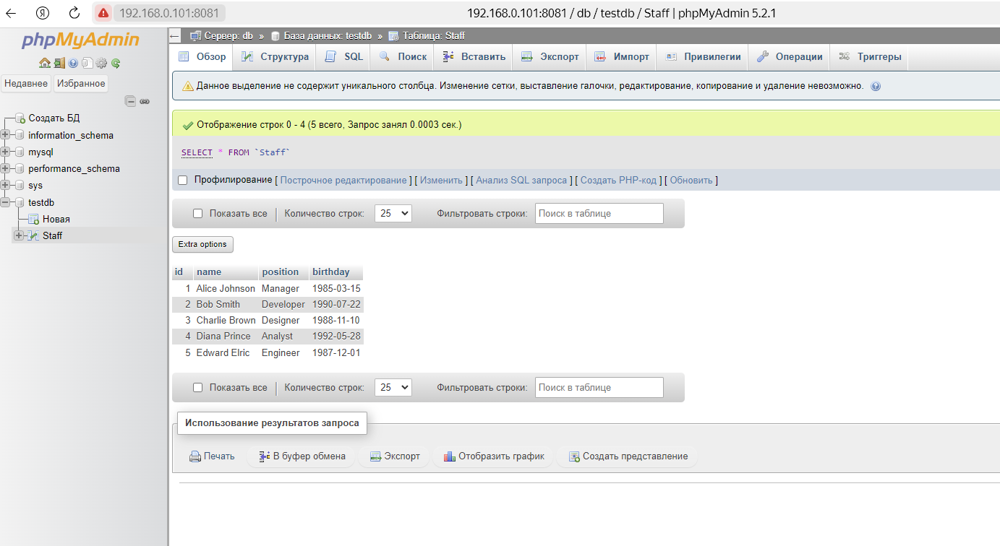

# home_work_docker_3
## Задание:
1) запустить контейнер с БД, отличной от mariaDB, используя инструкции на сайте: https://hub.docker.com/
2) добавить в контейнер hostname такой же, как hostname системы через переменную
3) заполнить БД данными через консоль
4) запустить phpmyadmin (в контейнере) и через веб проверить, что все введенные данные доступны

## запустить контейнер с БД, отличной от mariaDB, используя инструкции на сайте: https://hub.docker.com/
```
docker run --name some-mysql -e MYSQL_ROOT_PASSWORD=my-secret-pw -d mysql:9.0.0
```
```
root@docker-cloud:/home/user# docker ps
CONTAINER ID   IMAGE         COMMAND                  CREATED          STATUS         PORTS                 NAMES
8a7194edde9f   mysql:9.0.0   "docker-entrypoint.s…"   14 seconds ago   Up 5 seconds   3306/tcp, 33060/tcp   some-mysql
```
## добавить в контейнер hostname такой же, как hostname системы через переменную
```
docker run -it --name gb-test --hostname $(hostname) ubuntu:22.10
```
## заполнить БД данными через консоль
### Подключение к MySQL изнутри контейнера
* запуск терминала контрейнера mysql
```
docker exec -it some-mysql bash
```
* подключение к БД
```
mysql -u root -p
```
* Заполнение данными
```
mysql>  CREATE DATABASE testdb DEFAULT CHARACTER SET utf8 DEFAULT COLLATE utf8_general_ci;
Query OK, 1 row affected, 2 warnings (0.56 sec)

mysql> show databases;
+--------------------+
| Database           |
+--------------------+
| information_schema |
| mysql              |
| performance_schema |
| sys                |
| testdb             |
+--------------------+
5 rows in set (0.04 sec)

mysql> use newdb
ERROR 1049 (42000): Unknown database 'newdb'
mysql> use testdb;
Database changed
mysql> CREATE TABLE Staff
    -> (
    ->     id INT,
    ->     name VARCHAR(255) NOT NULL,
    ->     position VARCHAR(30),
    ->     birthday Date
    -> );
Query OK, 0 rows affected (0.58 sec)

mysql> INSERT INTO Staff (id, name, position, birthday) VALUES
    -> (1, 'Alice Johnson', 'Manager', '1985-03-15'),
    -> (2, 'Bob Smith', 'Developer', '1990-07-22'),
    -> (3, 'Charlie Brown', 'Designer', '1988-11-10'),
    -> (4, 'Diana Prince', 'Analyst', '1992-05-28'),
    -> (5, 'Edward Elric', 'Engineer', '1987-12-01');
Query OK, 5 rows affected (0.00 sec)
Records: 5  Duplicates: 0  Warnings: 0

mysql> SELECT * From Staff;
+------+---------------+-----------+------------+
| id   | name          | position  | birthday   |
+------+---------------+-----------+------------+
|    1 | Alice Johnson | Manager   | 1985-03-15 |
|    2 | Bob Smith     | Developer | 1990-07-22 |
|    3 | Charlie Brown | Designer  | 1988-11-10 |
|    4 | Diana Prince  | Analyst   | 1992-05-28 |
|    5 | Edward Elric  | Engineer  | 1987-12-01 |
+------+---------------+-----------+------------+
5 rows in set (0.00 sec)

```
## запустить phpmyadmin (в контейнере) и через веб проверить, что все введенные данные доступны
* Установка и запуск phpmyadmin
```
docker run --name phpmyadmin -d --link some-mysql:db -p 8081:80 phpmyadmin/phpmyadmin
```
